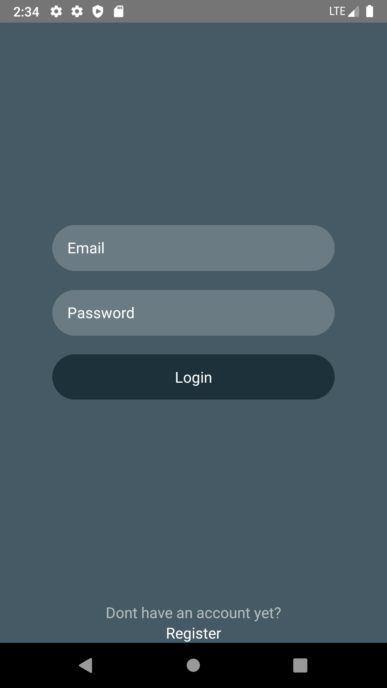

# Hiring Channel App

## Table of contents
- [Hiring Channel App](#hiring-channel-app)
  - [Table of contents](#table-of-contents)
  - [General info](#general-info)
  - [Built With](#built-with)
  - [Features](#features)
  - [Requirements](#requirements)
  - [Setup](#setup)
  - [Screenshot](#screenshot)
  - [Release APK](#release-apk)
  - [Contact](#contact)
  - [Contributors](#contributors)

## General info
Hiring Channel app is a simple application to connect companies with job seekers. This project for handle frontend only. Built using ReactNative.
ReactNative is A JavaScript framework for building user interfaces. [More about ReactNative](https://facebook.github.io/react-native/)

## Built With
Project is created with:

[](https://nodejs.org/en/)
[](https://facebook.github.io/react-native/)
[](https://react-redux.js.org/)

## Features
* User can create engineer or company account
* User can make a profile
* User can see another user profile
* And others

## Requirements
1. <a href="https://www.npmjs.com/get-npm">NPM</a>
2. [Hiring Channel Backend API](https://github.com/alfatahh54/Restful-Api-Hiring-Chanel-App)
3. [react-native](https://facebook.github.io/react-native/docs/getting-started)
4. [react-native-cli](https://facebook.github.io/react-native/docs/getting-started)

## Setup
Steps to run this project:

- Clone this project
 
	``` git clone https://github.com/alfatahh54/Hiring-Chanel-App-RN.git ```
	
 - Install NPM Packages
 
	``` npm install ```
	
 - Run Project
 
	``` npx react-native run-android ```


## Screenshot

<div align="center">



</div>


## Release APK
<a href="https://drive.google.com/file/d/1F1rfloZu55tCl1pA_WQei81SImV8zHOi/view?usp=sharing">
  
</a>

## Contact

If you want to contact me you can reach me at <alfatah215@gmail.com>.

## Contributors

<center>
  <table>
    <tr>
      <td align="center">
        <a href="https://github.com/alfatahh54">
          <br/>
          <sub><b>Alfatah Hidayat</b></sub>
        </a>
      </td>
    </tr>
  </table>
</center>
